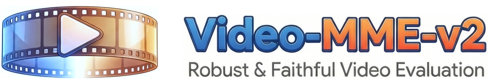
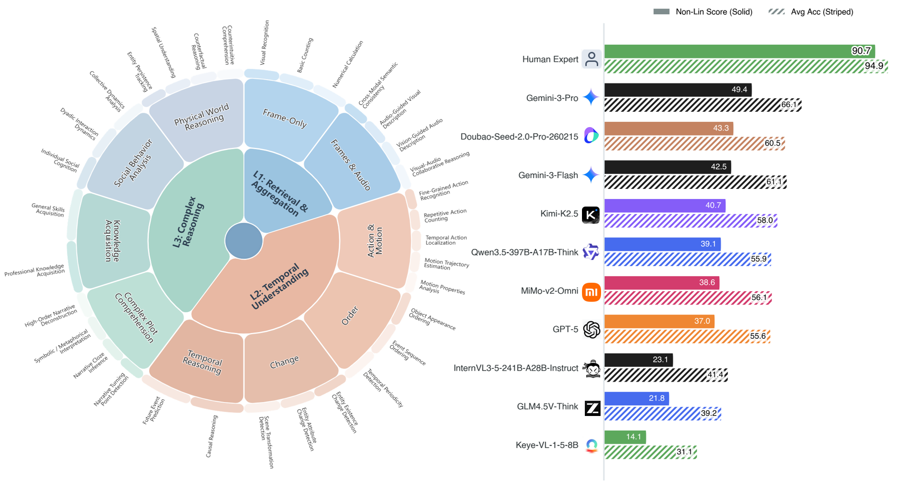
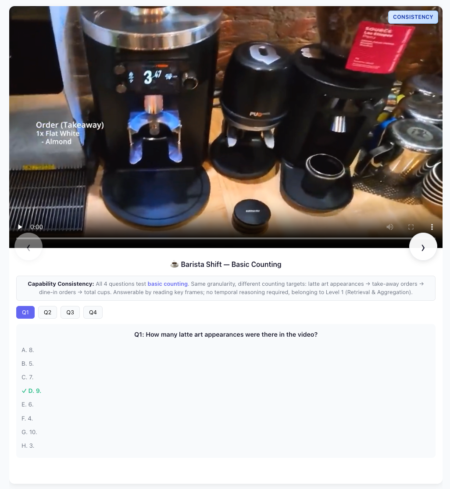
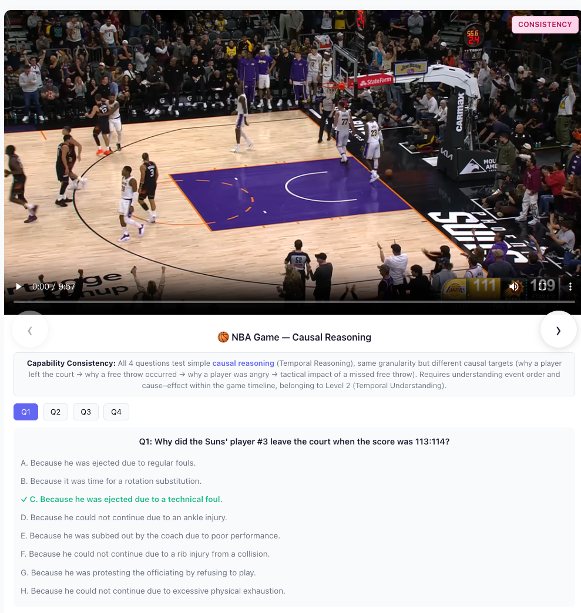
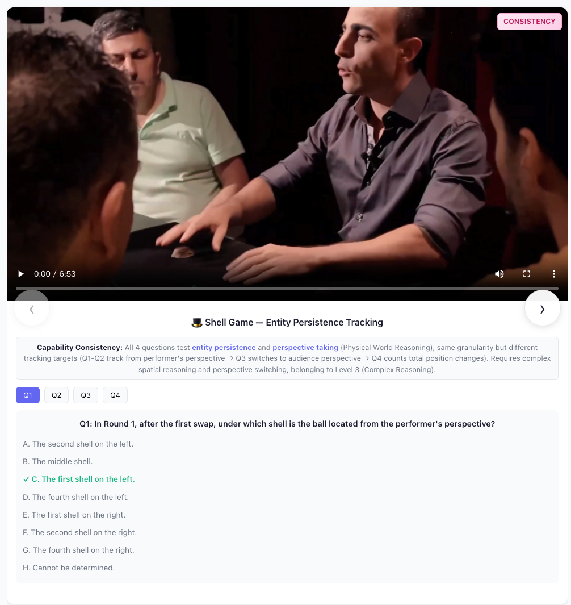
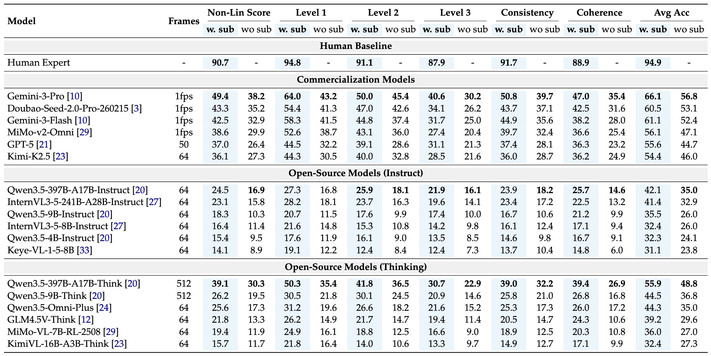
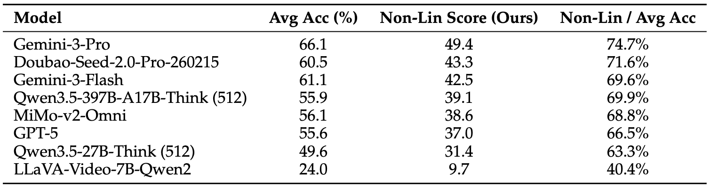
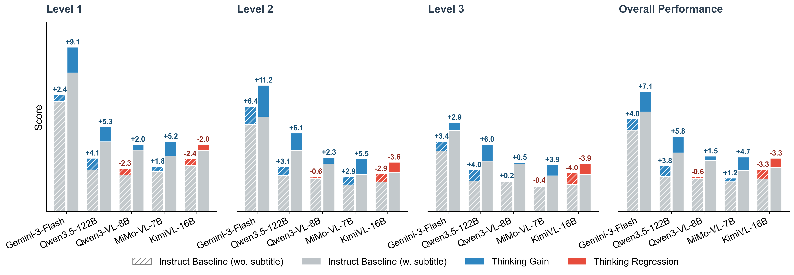
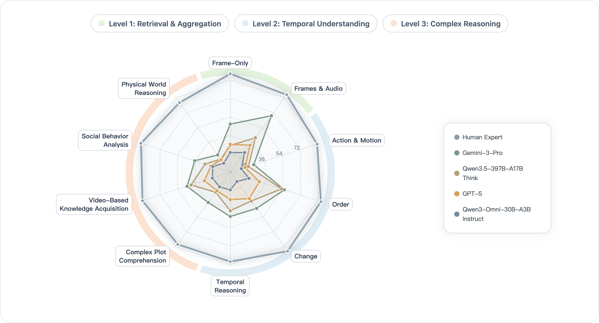

# Video-MME-v2: Towards the Next Stage in Video Understanding Evaluation

[](https://huggingface.co/datasets/MME-Benchmarks/Video-MME-v2)
[](https://arxiv.org/abs/2604.xxxxx)  
 
 


<p align="center">
    
</p>

<font size=7><div align='center' > [[🍎 Project Page](https://video-mme-v2.netlify.app/)] [[📖 Paper](https://github.com/MME-Benchmarks/Video-MME-v2/blob/main/Video_MME_v2-TechReport.pdf)] [[🤗 Dataset](https://huggingface.co/datasets/MME-Benchmarks/Video-MME-v2)] [[🏆 Leaderboard](https://video-mme-v2.netlify.app/#leaderboard)]  </div></font>

---

## 🔥 News
* **`2026.04.07`** 🌟 We are very proud to launch Video-MME-v2, built upon over **3,300 human-hours** annotation. At this key moment in the evolution of video understanding, we aim to share our thinking on the next generation of evaluation paradigms and to help drive higher-quality technical iteration for video understanding models.

## Contents

- [🔥 News](#-news)
- [👀 Video-MME-v2 Overview](#-video-mme-v2-overview)
  - [🌟 Key Innovations](#-key-innovations)
- [📐 Dataset Examples](#-dataset-examples)
- [🔍 Dataset](#-dataset)
- [🔮 Evaluation Pipeline](#-evaluation-pipeline)
- [🏆 Experiments & Analysis](#-experiments--analysis)
  - [1. Advantage of Non-Linear Scoring](#1-advantage-of-non-linear-scoring)
  - [2. Effect of Thinking Mode on Video-MME v2](#2-effect-of-thinking-mode-on-video-mme-v2)
  - [3. Capability Radar](#3-capability-radar)
- [📝 Citation](#-citation)
- [📜 Related Works](#-related-works)

---

## 👀 Video-MME-v2 Overview

In 2024, our [**Video-MME**](https://video-mme.github.io/) benchmark became a standard evaluation set for frontier models like Gemini and GPT. However, as model capabilities rapidly evolve, scores on existing benchmarks are saturating, yet a clear gap remains between **leaderboard performance and actual user experience**. This indicates that current evaluation paradigms fail to capture true video understanding abilities. To address this, we spent a year redesigning the evaluation system from first principles and now introduce **Video-MME-v2**—a progressive and robust benchmark designed to drive the next generation of video understanding models.

### 🌟 Key Innovations

* **Progressive Multi-Level Evaluation Dimensions**: We systematically decompose video understanding into a three-level progression from "finding information" to "modeling time" to "cross-temporal reasoning":
  * **Level 1 (Multi-Point Information Aggregation)**: Retrieves, extracts, and integrates multimodal cues (frames, audio, subtitles) scattered throughout a video.
  * **Level 2 (Temporal Understanding)**: Focuses on dynamic evolution and causal relations, requiring models to accurately capture state changes, action sequences, and event logic.
  * **Level 3 (Temporal Complex Reasoning)**: Requires combining multimodal temporal information with external priors (world knowledge, social commonsense) to perform complex reasoning tasks.
* **Grouped Non-Linear Evaluation Mechanism**: We organize questions into groups targeting "capability consistency" and "reasoning coherence". Each group contains 4 interrelated questions, and we adopt a non-linear scoring scheme where scores depend not only on individual accuracy but also on overall consistency and the completeness of the reasoning loop.
* **Rigorous Data Annotation and Quality Control**: We establish a comprehensive data annotation process involving 3,300 human-hours from 60+ experts.

<p align="center">
    
</p>

## 📐 Dataset Examples

Our dataset is uniquely structured into groups of 4 questions, targeting either **Consistency** or **Coherence**. Below are three representative examples across different cognitive levels. 

> 💡 **Note:** The following are just static screenshots of the examples. For a more interactive experience and to explore many more detailed cases across all 3 levels, please visit our [Project Page-Examples](https://video-mme-v2.netlify.app/#examples).

<details>
<summary><b>🔍 Level 1: Retrieval & Aggregation (Click to expand)</b></summary>
<br>

<p align="center">
    
</p>

</details>

<details>
<summary><b>⏱️ Level 2: Temporal Understanding (Click to expand)</b></summary>
<br>

<p align="center">
    
</p>

</details>

<details>
<summary><b>🧠 Level 3: Complex Reasoning (Click to expand)</b></summary>
<br>

<p align="center">
    
</p>

</details>

## 🔍 Dataset

**License**:
```
Video-MME-v2 is only used for academic research. Commercial use in any form is prohibited.
The copyright of all videos belongs to the video owners.
If there is any infringement in Video-MME-v2, please email bradyfu24@gmail.com and we will remove it immediately.
Without prior approval, you cannot distribute, publish, copy, disseminate, or modify Video-MME-v2 in whole or in part.
You must strictly comply with the above restrictions.
```

The dataset is hosted on Hugging Face: [MME-Benchmarks/Video-MME-v2](https://huggingface.co/datasets/MME-Benchmarks/Video-MME-v2).

It contains **800 videos** (in 40 zip archives), **800 word-level subtitle files** (JSONL format with timestamps), and a `test.parquet` with **3,200 human-annotated question-answer pairs** (4 questions per video, organized into groups).

## 🔮 Evaluation Pipeline

📍 **Frames and Subtitles**:

There are a total of **800 videos** and **800 subtitle files**. Each subtitle file (`<video_id>.jsonl`) contains word-level entries with timestamps:

```json
{"text": "Hello", "start_time": 0.5, "end_time": 0.8}
{"text": "world", "start_time": 0.8, "end_time": 1.1}
```

With respect to the setting of adding subtitles, we provide two modes:
- **Concatenated**: All subtitle words are joined into a single text block and appended to the frame description.
- **Interleaved**: Subtitle words are matched to their corresponding time intervals between adjacent frames, providing temporally aligned context.

📍 **Prompt**:

The common prompt used in our evaluation follows this format:

```
These are the frames of a video.
This video's subtitles are listed below:
[Subtitles]
Select the best answer to the following multiple-choice question based on the video.
Respond with only the letter (A, B, C, D, E, F, G, or H) of the correct option.
Question: [Question]
[Options A-H]
```

For the subtitles-free setting, the subtitle content is removed. For the thinking/reasoning setting, the instruction is replaced with:

```
Please perform a detailed reasoning based on the provided video frames to answer the following
multiple-choice question selecting the best option from A through H and providing your final
response strictly in the format: 'Final Answer: <letter>.
```

<details>
<summary> Click to expand the prompt examples.</summary>

* With subtitles:
```
These are the frames of a video.
This video's subtitles are listed below:
Hi guys, I'm going to show you how to perfectly prepare a ...
Select the best answer to the following multiple-choice question based on the video.
Respond with only the letter (A, B, C, D, E, F, G, or H) of the correct option.
Question: What is the ethnicity of the protagonist's mother?
A. Malaysian.
B. British.
C. Singaporean.
D. German.
E. Canadian.
F. Chinese.
G. American.
H. Cannot be determined.
```

* Without subtitles:
```
These are the frames of a video.
Select the best answer to the following multiple-choice question based on the video.
Respond with only the letter (A, B, C, D, E, F, G, or H) of the correct option.
Question: What is the ethnicity of the protagonist's mother?
A. Malaysian.
B. British.
C. Singaporean.
D. German.
E. Canadian.
F. Chinese.
G. American.
H. Cannot be determined.
```
</details>


📍 **Evaluation with VLMEvalKit & LMMs-Eval**:

We are actively integrating Video-MME-v2 into both [VLMEvalKit](https://github.com/open-compass/VLMEvalKit) and [LMMs-Eval](https://github.com/EvolvingLMMs-Lab/lmms-eval). Support for both toolkits will be available within this week. Stay tuned!

Once ready, [VLMEvalKit](https://github.com/open-compass/VLMEvalKit) will provide built-in support for Video-MME-v2. It automatically downloads the dataset from Hugging Face, extracts video frames, builds prompts with the correct format, and computes the grouped non-linear scores.

```bash
# Install VLMEvalKit
git clone https://github.com/open-compass/VLMEvalKit.git && cd VLMEvalKit
pip install -e .

# Run evaluation (e.g., Qwen2.5-VL-7B, 64 frames, without subtitle)
python run.py --model Qwen3-VL-8B-Instruct --data Video-MME-v2_64frame

# With subtitle (concatenated)
python run.py --model Qwen3-VL-8B-Instruct --data Video-MME-v2_64frame_subs

# With subtitle (interleaved between frames)
python run.py --model Qwen3-VL-8B-Instruct --data Video-MME-v2_64frame_subs_interleave

# With reasoning/thinking prompt
python run.py --model Qwen3-VL-8B-Instruct --data Video-MME-v2_64frame_reasoning
```

All available dataset configurations:

| Configuration | Frames | Subtitle | Reasoning |
|:---|:---:|:---:|:---:|
| `Video-MME-v2_64frame` | 64 | ✗ | ✗ |
| `Video-MME-v2_1fps` | 1 fps | ✗ | ✗ |
| `Video-MME-v2_64frame_subs` | 64 | concat | ✗ |
| `Video-MME-v2_1fps_subs` | 1 fps | concat | ✗ |
| `Video-MME-v2_64frame_subs_interleave` | 64 | interleave | ✗ |
| `Video-MME-v2_1fps_subs_interleave` | 1 fps | interleave | ✗ |
| `Video-MME-v2_64frame_reasoning` | 64 | ✗ | ✓ |
| `Video-MME-v2_64frame_reasoning_subs` | 64 | concat | ✓ |
| `Video-MME-v2_64frame_reasoning_subs_interleave` | 64 | interleave | ✓ |

📍 **Standalone Evaluation with Transformers**:

We also provide a standalone inference & evaluation script ([`evaluation/test_video_mme_v2.py`](evaluation/test_video_mme_v2.py)) that runs end-to-end with HuggingFace Transformers — no external evaluation toolkit needed. It handles frame extraction with caching, subtitle loading (JSONL), prompt construction, model inference, answer extraction, and grouped non-linear scoring, all in one script.

**Dependencies:**

```bash
pip install torch transformers accelerate decord pandas numpy pillow tqdm
```

**Quick Start:**

```bash
# Basic evaluation (64 frames, no subtitle, no reasoning)
python evaluation/test_video_mme_v2.py \
    --model Qwen/Qwen2.5-VL-7B-Instruct \
    --parquet /path/to/test.parquet \
    --video-dir /path/to/videos \
    --nframe 64

# With subtitle (concatenated)
python evaluation/test_video_mme_v2.py \
    --model Qwen/Qwen2.5-VL-7B-Instruct \
    --parquet /path/to/test.parquet \
    --video-dir /path/to/videos \
    --subtitle-dir /path/to/subtitles \
    --with-subtitle \
    --nframe 64

# With subtitle (interleaved between frames)
python evaluation/test_video_mme_v2.py \
    --model Qwen/Qwen2.5-VL-7B-Instruct \
    --parquet /path/to/test.parquet \
    --video-dir /path/to/videos \
    --subtitle-dir /path/to/subtitles \
    --with-subtitle --subtitle-interleave \
    --nframe 64

# With reasoning/thinking prompt
python evaluation/test_video_mme_v2.py \
    --model Qwen/Qwen2.5-VL-7B-Instruct \
    --parquet /path/to/test.parquet \
    --video-dir /path/to/videos \
    --nframe 64 --reasoning

# Full example: subtitle (interleaved) + reasoning
python evaluation/test_video_mme_v2.py \
    --model /path/to/your/model \
    --parquet /path/to/test.parquet \
    --video-dir /path/to/videos \
    --subtitle-dir /path/to/subtitles \
    --nframe 64 \
    --with-subtitle --subtitle-interleave --reasoning
```

**Key Arguments:**

| Argument | Default | Description |
|:---|:---|:---|
| `--model` | *(required)* | HuggingFace model name or local path |
| `--parquet` | — | Path to `test.parquet` |
| `--video-dir` | — | Directory containing video files |
| `--subtitle-dir` | `None` | Directory with per-video JSONL subtitle files (required when `--with-subtitle`) |
| `--nframe` | `64` | Number of frames to uniformly sample per video |
| `--fps` | `-1` | Extract frames at this FPS (overrides `--nframe` if > 0) |
| `--with-subtitle` | `False` | Enable subtitle input |
| `--subtitle-interleave` | `False` | Interleave subtitles between frames by timestamp (requires `--with-subtitle`) |
| `--reasoning` | `False` | Use the thinking/reasoning prompt |
| `--output` | auto-generated | Path for the output TSV file |
| `--dtype` | `bfloat16` | Model precision (`float16`, `bfloat16`, `float32`) |
| `--attn-impl` | `sdpa` | Attention implementation (`sdpa`, `flash_attention_2`, `eager`) |
| `--temperature` | `0.0` | Sampling temperature (0 = greedy) |
| `--max-new-tokens` | `4096` | Maximum tokens to generate |

The script supports **automatic resumption** — if interrupted, simply re-run the same command and it will pick up from where it left off. Results are periodically saved every 50 questions. After inference, it automatically runs evaluation and outputs per-level scores, relevance/logic breakdowns, and fine-grained capability ratings.

📍 **Scoring**:

Video-MME-v2 uses a **grouped non-linear scoring** mechanism. Questions are organized into groups of 4, and each group is scored based on either:
- **Relevance** (capability consistency): An exponential score map based on the number of correct answers within the group.
- **Logic** (reasoning coherence): A chain-based score that rewards consecutive correct answers, respecting the dependency structure within the group.

The evaluation does not require any third-party models (e.g., GPT) — answer extraction uses regex matching by default.

📍 **Leaderboard**:

If you want to add your model to our [leaderboard](https://video-mme-v2.netlify.app/#leaderboard), please send model responses to **bradyfu24@gmail.com**.


## 🏆 Experiments & Analysis

> 💡 **Note:** The analysis below represents just a few highlights. For a more comprehensive breakdown, interactive charts, and detailed findings, please visit our [Project Page-Analysis](https://video-mme-v2.netlify.app/#analysis).

<p align="center">
    
</p>

> **Representative Results on the Leaderboard.** *w. sub* = with subtitle/audio; *wo sub* = without subtitle/audio (visual frames only). For Omni models that accept raw audio (e.g., MiMo-v2-Omni, Gemini-3-Pro), as well as the human baseline, we report results with raw audio input under the *w. sub* setting. This table presents a curated subset of models; for the complete leaderboard, please visit our [Project Page-Leaderboard](https://video-mme-v2.netlify.app/#leaderboard).

We conduct systematic evaluations on leading video MLLMs, revealing several critical insights:

### 1. Advantage of Non-Linear Scoring

<p align="center">
    
</p>

> **Avg Acc vs. Non-Lin Score.** The gap and the ratio reflect robustness: whether a model can answer multiple correlated questions correctly within the same group.

* **1. Within-model comparison:** Gemini-3-Pro and Gemini-3-Flash reach average accuracy of 66.1% and 61.1% respectively—well above passing level. Under our group-based non-linear scoring, however, their scores are 49.4% and 42.5%. This shows that even SOTA models rarely answer all related questions in a group correctly. Our non-linear design exploits the group structure and reduces sensitivity to "scattered hits."
* **2. Cross-model comparison:** The ratio Non-Lin Score / Avg Acc reflects how much a model "drops" from single-question correctness to group-stable correctness, and thus indicates robustness. For example, Gemini-3-Pro has a ratio of about 75%, Doubao-Seed-2.0-Pro-260215 about 72%, while InternVL3-5-241B-A28B-Instruct is about 56%, and smaller models such as LLaVA-Video-7B are only about 40%. A lower ratio means the model more often gets only some questions right within a group—weaker stability and robustness. Non-linear scoring thus better reflects true capability and reveals model robustness.

### 2. Effect of Thinking Mode on Video-MME v2

<p align="center">
    
</p>

> **Effect of Thinking Mode on Video-MME-v2.** Performance changes under with-subtitle vs. without-subtitle settings across levels and overall.

* **1. Text modality helps unlock reasoning:** Overall, enabling Thinking with subtitles tends to yield more stable gains, while without subtitles the benefit is often smaller or can even turn negative. For example, Qwen3.5-122B-A10B gains +3.8 with no subtitle and +5.8 with subtitle on overall score. This suggests that explicit semantic cues from text make it easier for the model’s Thinking ability to be fully utilized.
* **2. Current Thinking mode can still cause regression:** Besides the general pattern that subtitles help Thinking, we still observe clear regressions for some settings, especially without subtitles. For example, Qwen3-VL-8B shows -0.6 without subtitle on overall score, while KimiVL-16B drops by -3.3 / -3.3 (no / with subtitle), and on Level 3, where Thinking matters most, it further drops by -4.0 / -3.9. This shows that the current Thinking mechanism in video MLLMs does not always bring positive benefit on video understanding tasks and still has substantial room for improvement.

### 3. Capability Radar

<p align="center">
    
</p>

> **Capability Radar Across Video-MME-v2 Dimensions.** Model comparisons across fine-grained capability dimensions. This radar chart presents partial results; for more fine-grained performance analysis across a wider range of models, please visit our [Project Page-Analysis](https://video-mme-v2.netlify.app/#analysis).

* **1. Significant gain from audio:** On the Frames & Audio dimension, Gemini-3-Pro shows a relatively high peak, indicating stronger cross-modal alignment and integration when processing synchronized visual and audio information. In contrast, models that rely more on visual frames (e.g. GPT-5 and the Qwen family) are relatively weaker, reflecting differences in deep multimodal fusion.
* **2. Long-horizon temporal reasoning advantage:** On capabilities such as Order and Video-Based Knowledge Acquisition, which rely on long-horizon temporal modeling and cross-segment reasoning over long video frames, Gemini-3-Pro also maintains a large lead, indicating more robust long-context and temporal modeling, and better ability to integrate and reason over information across segments in long videos.
* **3. Clear room for improvement:** Overall, even as a SOTA model, Gemini-3-Pro still has significant room for improvement on each dimension. In particular, on Action & Motion and Physical World Reasoning, scores remain below 30, reflecting that current models still need to strengthen fine-grained action semantics and physical-world reasoning.


## 📝 Citation

If you find our work helpful for your research, please consider citing our work.   

```bibtex
@inproceedings{fu2025video,
  title={Video-mme: The first-ever comprehensive evaluation benchmark of multi-modal llms in video analysis},
  author={Fu, Chaoyou and Dai, Yuhan and Luo, Yongdong and Li, Lei and Ren, Shuhuai and Zhang, Renrui and Wang, Zihan and Zhou, Chenyu and Shen, Yunhang and Zhang, Mengdan and others},
  booktitle={CVPR},
  year={2025}
}

@inproceedings{fu2025mme,
  title={Mme: A comprehensive evaluation benchmark for multimodal large language models},
  author={Fu, Chaoyou and Chen, Peixian and Shen, Yunhang and Qin, Yulei and Zhang, Mengdan and Lin, Xu and Yang, Jinrui and Zheng, Xiawu and Li, Ke and Sun, Xing and others},
  booktitle={NeurIPS Datasets and Benchmarks Track},
  year={2025}
}

@article{zhang2024mme,
  title={MME-RealWorld: Could Your Multimodal LLM Challenge High-Resolution Real-World Scenarios that are Difficult for Humans?},
  author={Zhang, Yi-Fan and Zhang, Huanyu and Tian, Haochen and Fu, Chaoyou and Zhang, Shuangqing and Wu, Junfei and Li, Feng and Wang, Kun and Wen, Qingsong and Zhang, Zhang and others},
  journal={ICLR},
  year={2025}
}

@article{fu2024mme,
  title={MME-Survey: A Comprehensive Survey on Evaluation of Multimodal LLMs},
  author={Fu, Chaoyou and Zhang, Yi-Fan and Yin, Shukang and Li, Bo and Fang, Xinyu and Zhao, Sirui and Duan, Haodong and Sun, Xing and Liu, Ziwei and Wang, Liang and others},
  journal={arXiv preprint arXiv:2411.15296},
  year={2024}
}
```

## 📜 Related Works

Explore our related researches:
-  **[Video-MME]** [Video-MME: The First-Ever Comprehensive Evaluation Benchmark of Multi-Modal LLMs in Video Analysis](https://openaccess.thecvf.com/content/CVPR2025/papers/Fu_Video-MME_The_First-Ever_Comprehensive_Evaluation_Benchmark_of_Multi-modal_LLMs_in_CVPR_2025_paper.pdf)
-  **[MME]** [MME: A Comprehensive Evaluation Benchmark for Multimodal Large Language Models](https://arxiv.org/pdf/2306.13394)
-  **[MME-RealWorld]** [MME-RealWorld: Could Your Multimodal LLM Challenge High-Resolution Real-World Scenarios that are Difficult for Humans?](https://arxiv.org/pdf/2408.13257)
-  **[MME-Survey]** [MME-Survey: A Comprehensive Survey on Evaluation of Multimodal LLMs](https://arxiv.org/pdf/2411.15296)
-  **[Awesome-MLLM]** [A Survey on Multimodal Large Language Models](https://github.com/BradyFU/Awesome-Multimodal-Large-Language-Models)

